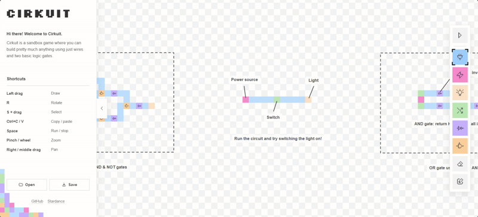

# Cirkuit

Build your own circuits using pixel art!

Cirkuit is a pixel-art circuit sandbox. Place components on the grid, connect
them, and build whatever you want!

[Try Cirkuit online](https://nafo44.github.io/Cirkuit/)

> AI was used as a source of information during the development of this
> project, and sometimes to generate code snippets for specific implementation problems.
> All generated code was reviewed. The concept, UI/UX, and assets were created
> entirely by me.



## Recommanded setup

It is recommended to use a laptop or desktop computer with a mouse to use Circuit, although use with a laptop touchpad is also supported.

## Controls

> Shortcuts are also shown in-game.

### Edit mode:

- **Left drag**: Draw
- **R**: Rotate
- **S + drag**: Select
- **Ctrl+C / Ctrl+V**: Copy / paste
- **Space**: Run / stop
- **Pinch / wheel**: Zoom
- **Right / middle drag**: Pan

### Simulation mode:

- **Click**: Toggle switch
- **Space**: Run / stop
- **Pinch / wheel**: Zoom
- **Right / middle drag**: Pan

## Features

One of the project's main goals was to optimize the user experience.
That is why Cirkuit offer only essentials features:

- Project import/export: projects are saved as .cirkuit files.
- 2 modes: editing and simulation. Press the Space bar or the button at the top of the sidebar to start the simulation.
- Various components: power source, wire, lamp, switch, NOT gate, AND gate.
- Annotation: Cirkuit provides three tools for documenting your projects: label, line, and rectangle.
- Selection: you can select, copy/paste, and move groups of elements, making it much easier to modify your circuit!
- Eraser: it erases lol

## Development

Node.js 24 and npm are recommended.

```shell
npm ci
npm run dev
```

Run all checks before committing:

```shell
npm run format:check
npm run lint
npm test -- --run
npm run build
```

## How it works

The editor, circuit model, and simulation engine are kept separate. It makes it possible to change one part without having to rewrite everything else.

### From pixels to electrical nets

Every component placed in the editor is stored in the circuit layout with its ID, type, position, and rotation. The actual behavior of the component lives in a separate registry, which defines its ports, outputs, and state.

When the simulation starts, the grid gets compiled into a netlist. The compiler handles things like rotating component ports, connecting ports that are next to each other and facing each other, and grouping connected conductive parts into nets.

So basically, if you draw a row of connected wire pixels, the compiler turns all of them into one shared electrical net.

### Signal simulation

Each net can be `floating`, `low`, `high`, or `conflict`. The simulation engine propagates the signals until everything settles into a stable state.

Switches are also handled on simulation ticks, so toggling one applies the change atomically on the next tick. If the circuit contains an unstable loop, the engine detects it and reports it instead of getting stuck and freezing the editor.

### Modularity and project files

Components own their ports and simulation logic, as mentioned above. This keeps the rest of the system fairly dumb: adding a new component don't require changing the netlist compiler or the simulation engine.

Projects are stored as `.cirkuit` JSON files. Zod validates documents when they're imported and exported, so malformed projects or projects modified manually can't crash the editor during runtime.

Things like unknown component types, duplicate IDs, overlapping components, or components placed outside the grid are rejected.
